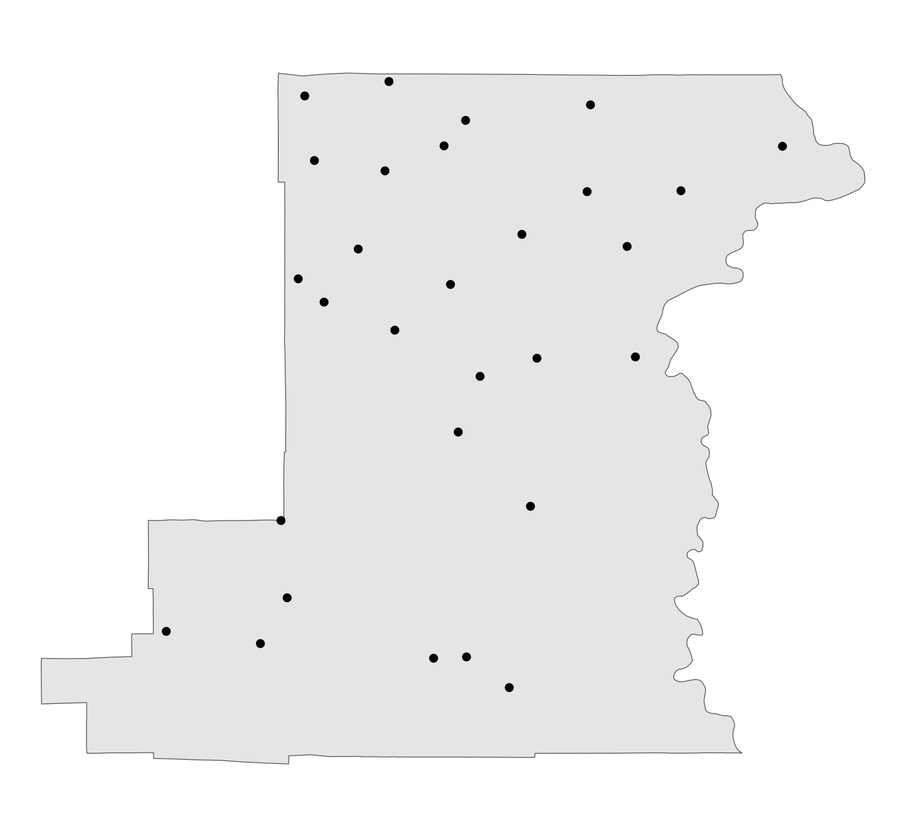
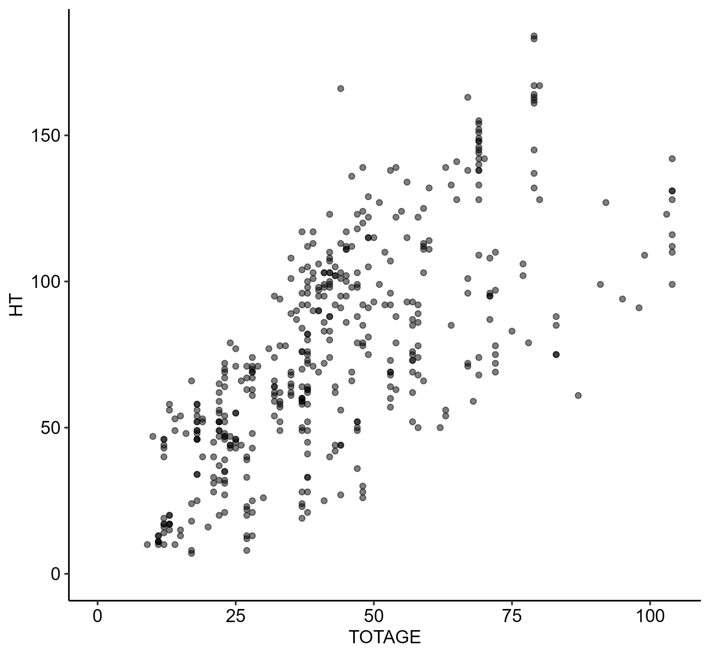
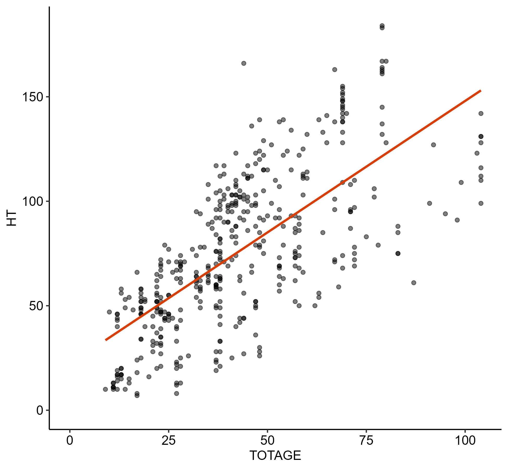
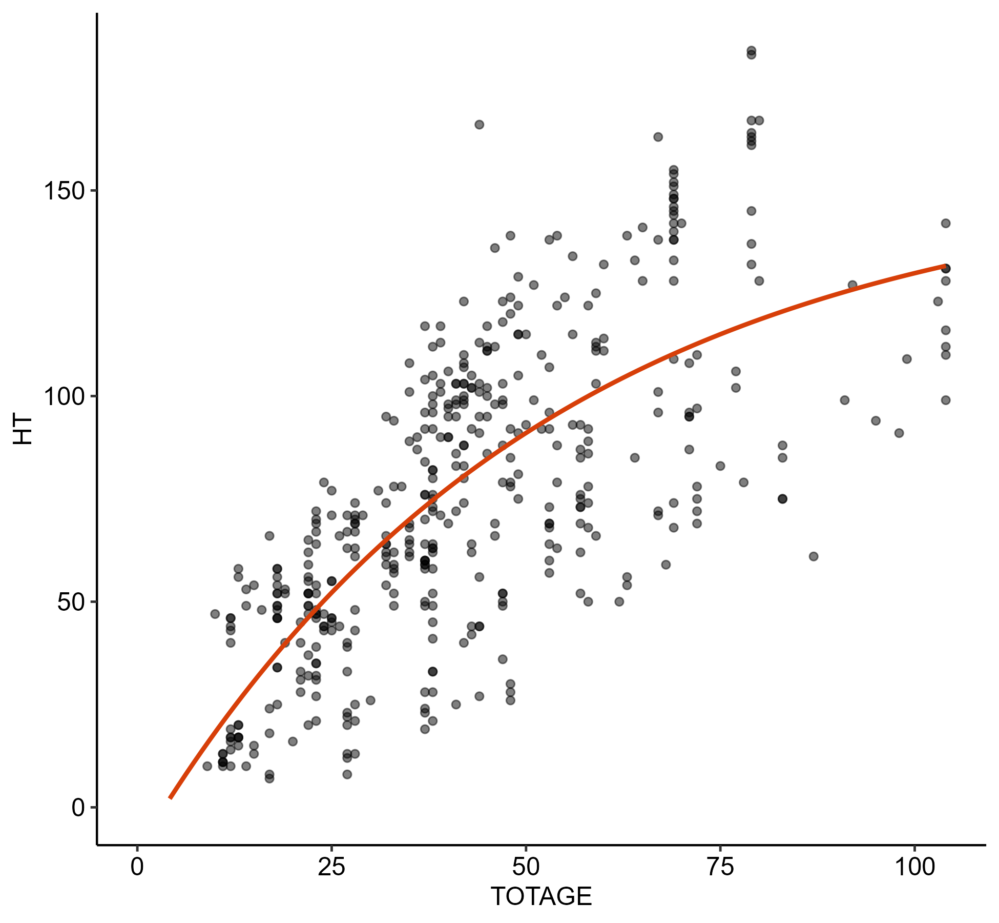

# Sketching Tree Growth


# Objectives

This document processes data, fits a couple of models, then visualizes
and discusses results.

Some specific objectives are:

1.  Figure out the basic structure of Forest Inventory and Analysis
    (FIA) data.
2.  Set up data to model height at age for individual trees in Benton
    County, OR.
3.  Fit a simple linear regression and a minimal Von Bertalanffy growth
    function (VBGF).

# Results Preview

- FIA data are great, but modeling height at age for individual trees
  might be tough.

- The data and models for Benton County work about as well as you’d
  expect.

- This exercise sets several questions for next steps.

# Results

## 1. Data

``` r
dat_or_plot = "data/OR_PLOT.csv" %>% read_csv # 9 MB
```

    Rows: 39471 Columns: 69
    ── Column specification ────────────────────────────────────────────────────────
    Delimiter: ","
    chr   (2): ECOSUBCD, MICROPLOT_LOC
    dbl  (52): CN, SRV_CN, CTY_CN, PREV_PLT_CN, INVYR, STATECD, UNITCD, COUNTYCD...
    lgl  (13): DESIGNCD_P2A, CONDCHNGCD_RMRS, FUTFORCD_RMRS, MANUAL_NCRS, MANUAL...
    dttm  (2): CREATED_DATE, MODIFIED_DATE

    ℹ Use `spec()` to retrieve the full column specification for this data.
    ℹ Specify the column types or set `show_col_types = FALSE` to quiet this message.

``` r
dat_or_tree = "data/OR_TREE.csv" %>% read_csv # 429 MB
```

    Rows: 749793 Columns: 197
    ── Column specification ────────────────────────────────────────────────────────
    Delimiter: ","
    chr    (2): P2A_GRM_FLG, GST_PNWRS
    dbl  (132): CN, PLT_CN, PREV_TRE_CN, INVYR, STATECD, UNITCD, COUNTYCD, PLOT,...
    lgl   (61): TREEGRCD, SALVCD, CVIGORCD, TREEHISTCD, CULLDEAD, CULLFORM, CULL...
    dttm   (2): CREATED_DATE, MODIFIED_DATE

    ℹ Use `spec()` to retrieve the full column specification for this data.
    ℹ Specify the column types or set `show_col_types = FALSE` to quiet this message.

``` r
#  Check whether data support growth models from TOTAGE or CN/PREV_TRE_CN.

dat_or_tree %>% nrow
```

    [1] 749793

``` r
#   TOTAGE describes one-off age estimates.

dat_totage_check = dat_or_tree %>% drop_na(TOTAGE) %>% nrow

dat_totage_check
```

    [1] 31835

``` r
#   Relating CN to PREV_TRE_CN identifies repeated observations.

dat_cn_check = 
  dat_or_tree %>% 
  select(CN, PREV_TRE_CN)

dat_id_check = 
  dat_cn_check %>% 
  left_join(dat_cn_check, by = c("PREV_TRE_CN" = "CN")) %>% 
  left_join(dat_cn_check, by = c("PREV_TRE_CN.y" = "CN"))

dat_id_check %>% drop_na(PREV_TRE_CN.x) %>% nrow
```

    [1] 325895

``` r
dat_id_check %>% drop_na(PREV_TRE_CN.y) %>% nrow
```

    [1] 27136

``` r
dat_id_check %>% drop_na(PREV_TRE_CN.y.y) %>% nrow
```

    [1] 0

``` r
# problem: there aren't a lot of trees with totage or repeated observations.
#  totage: 31835; these are almost all from 1999, which is unhelpful
#  cn: 325895 to 27136 to 0 for t-1, t-2, t-3

# so, lacking a perfect option, let's go with totage as the simpler imperfect option.

#  Subset to Benton County for local interest.

dat_benton = 
  dat_or_tree %>% 
  filter(COUNTYCD == 3) %>% 
  filter(!is.na(TOTAGE)) %>% 
  left_join(dat_or_plot %>% 
              filter(COUNTYCD == 3) %>% 
              select(INVYR,
                     MEASYEAR,
                     CN,
                     LON,
                     LAT,
                     ELEV),
            by = c("PLT_CN" = "CN",
                   "INVYR")) %>% 
  select(CN,
         INVYR,
         MEASYEAR,
         TOTAGE,
         DIA,
         HT,
         LON,
         LAT,
         ELEV) %>% 
  # Drop outliers for easier model fitting.
  mutate(rank = TOTAGE %>% percent_rank) %>% 
  filter(rank <= 0.90) %>% 
  select(-rank)
```

## 2. Geospatial Visualization

``` r
#  Get boundaries. These geodata originate with the Forest Service. 
#   See /data or /documentation for details.

dat_spa_boundaries = 
  "data/S_USA.ALPGeopoliticalUnit.gdb" %>% 
  vect %>% 
  subset(TYPENAMEREFERENCE == "County" & NAME == "Benton" & STATENAME == "Oregon", 
         NSE = TRUE)

dat_spa_plots = 
  dat_benton %>% 
  select(LON, LAT) %>% 
  distinct %>% 
  as.matrix %>% 
  vect("points",
       crs = crs(dat_spa_boundaries))

vis_spa_plots = 
  ggplot() + 
  geom_spatvector(data = dat_spa_boundaries) +
  geom_spatvector(data = dat_spa_plots) +
  theme_void()

ggsave("figures/vis_spa_plots.png",
       vis_spa_plots,
       dpi = 300,
       width = 6.5,
       height = 6.0,
       bg = "transparent")
```



There’s a fair number of plots with values for TOTAGE around Benton
County, so this subset could work.

## 3. Models and Visualization

``` r
#  Check out the data.

dat_benton %>% slice_head(n = 5)
```

    # A tibble: 5 × 9
         CN INVYR MEASYEAR TOTAGE   DIA    HT   LON   LAT  ELEV
      <dbl> <dbl>    <dbl>  <dbl> <dbl> <dbl> <dbl> <dbl> <dbl>
    1   704  1999     1997     37  10.4    60 -123.  44.7   558
    2   508  1999     1996     60  36.1   111 -123.  44.7   366
    3   509  1999     1996     27   2.9    20 -123.  44.7   366
    4   510  1999     1996     27   5.6    22 -123.  44.7   366
    5   702  1999     1997     37   9.1    60 -123.  44.7   558

``` r
vis_mod_scatter = 
  dat_benton %>% 
  ggplot() +
  geom_point(aes(x = TOTAGE,
                 y = HT),
             alpha = 0.50) +
  scale_x_continuous(limits = c(0, NA)) +
  scale_y_continuous(limits = c(0, NA)) +
  theme_pubr()

ggsave("figures/vis_mod_scatter.png",
       vis_mod_scatter,
       dpi = 300,
       width = 6.5,
       height = 6.0,
       bg = "transparent")
```



There’s some clustering that suggests some covariates matter, but it’s a
nice distribution.

``` r
#  Fit a linear model, just in case that does the trick.

mod_linear_benton = 
  dat_benton %>% 
  lm(formula = HT ~ TOTAGE, 
     data = .)

mod_linear_benton %>% summary
```


    Call:
    lm(formula = HT ~ TOTAGE, data = .)

    Residuals:
        Min      1Q  Median      3Q     Max 
    -70.649 -20.048   1.182  19.517  88.463 

    Coefficients:
                Estimate Std. Error t value Pr(>|t|)    
    (Intercept) 22.16636    2.87982   7.697 9.11e-14 ***
    TOTAGE       1.25842    0.06053  20.790  < 2e-16 ***
    ---
    Signif. codes:  0 '***' 0.001 '**' 0.01 '*' 0.05 '.' 0.1 ' ' 1

    Residual standard error: 26.63 on 444 degrees of freedom
    Multiple R-squared:  0.4933,    Adjusted R-squared:  0.4921 
    F-statistic: 432.2 on 1 and 444 DF,  p-value: < 2.2e-16

``` r
vis_mod_linear = 
  ggplot() + 
  geom_point(data = dat_benton,
             aes(x = TOTAGE,
                 y = HT),
             alpha = 0.50) +
  geom_line(data = dat_benton %>% filter(TOTAGE == TOTAGE %>% max | TOTAGE == TOTAGE %>% min),
            aes(x = TOTAGE,
                y = mod_linear_benton$coefficients[[1]] + mod_linear_benton$coefficients[[2]] * TOTAGE),
            alpha = 1.00,
            color = "#D73F09",
            linewidth = 1.00) +
  scale_x_continuous(limits = c(0, NA)) +
  scale_y_continuous(limits = c(0, NA)) +
  theme_pubr()

ggsave("figures/vis_mod_linear.png",
       vis_mod_linear,
       dpi = 300,
       width = 6.5,
       height = 6.0,
       bg = "transparent")
```



The simple linear model does a fair job, but doesn’t return any exciting
results.

``` r
#  Fit a nonlinear model (VBGF) for a more credible attempt.

library(gslnls) 

alpha_start = 200 # Asymptotic height.
beta_start = 1 # Inverse of annual growth rate.
gamma_start = 0 # Modeling artifact analogous to y-intercept.

mod_nonlinear_benton = 
  dat_benton %>% 
  filter(TOTAGE < 100) %>% 
  gsl_nls(fn = HT ~ alpha * (1 - exp(-(beta / 100) * (TOTAGE - gamma))),
          data = .,
          algorithm = "dogleg",
          start = c(alpha = alpha_start, 
                    beta = beta_start, 
                    gamma = gamma_start))

m_n_b_coef = mod_nonlinear_benton$m$getPars()

mod_nonlinear_benton %>% summary
```


    Formula: HT ~ alpha * (1 - exp(-(beta/100) * (TOTAGE - gamma)))

    Parameters:
          Estimate Std. Error t value Pr(>|t|)    
    alpha 153.9536    17.9108   8.596  < 2e-16 ***
    beta    1.9219     0.4562   4.212 3.07e-05 ***
    gamma   3.4451     2.2721   1.516     0.13    
    ---
    Signif. codes:  0 '***' 0.001 '**' 0.01 '*' 0.05 '.' 0.1 ' ' 1

    Residual standard error: 25.74 on 434 degrees of freedom

    Number of iterations to convergence: 8 
    Achieved convergence tolerance: 2.561e-09

``` r
fun_nonlinear_benton = 
  function(alpha, beta, gamma, age){
    alpha * (1 - exp(-(beta / 100) * (age - gamma)))
  }

vis_mod_nonlinear = 
  dat_benton %>% 
  ggplot() + 
  geom_point(aes(x = TOTAGE,
                 y = HT),
             alpha = 0.50) +
  geom_function(fun = fun_nonlinear_benton,
                args = list(alpha = m_n_b_coef[["alpha"]], 
                            beta = m_n_b_coef[["beta"]], 
                            gamma = m_n_b_coef[["gamma"]]),
                alpha = 1.00,
                color = "#D73F09",
                linewidth = 1.00) +
  scale_x_continuous(limits = c(0, NA)) +
  scale_y_continuous(limits = c(0, NA)) +
  theme_pubr()

ggsave("figures/vis_mod_nonlinear.png",
       vis_mod_nonlinear,
       dpi = 300,
       width = 6.5,
       height = 6.0,
       bg = "transparent")
```



The VBGF model also does a fair job. Casually, we might conclude the
VBGF model is more useful than the simple linear model in that it
represents decreasing growth in height at age. We might also conclude
the gamma parameter in the VBGF model might as well be zero, as in some
forestry literature.

# Brief Discussion

To recap initial objectives:

1.  FIA data represent fieldwork and analysis over a lot of different
    dimensions and units of analysis. That’s exciting for data
    exploration. However, it does require another round of discussion on
    objectives and constraints for growth modeling. One alternative to
    modeling height at age could be modeling stand biomass, as in
    [Chisholm and Gray
    (2024)](https://doi.org/10.1371/journal.pone.0302823). I’m sure
    there are other alternatives that could better fit project goals.
2.  FIA data constrain modeling height at age on repeated observations
    or one-off estimates of age, in that observations are not often
    repeated and there are not a lot of one-off estimates of age. There
    were enough one-off estimates of age to support simple models of
    height at age for Benton County, though, which is neat.
3.  The linear and nonlinear models for height at age did not return
    surprising results, although both were fine for the scope of this
    exercise. If modeling height at age (or other growth metrics) is of
    interest beyond this exercise, then these initial results might
    support further discussion.

Broadly:

- Having done this, I’m in a better position to wrangle FIA data.

- Messing with height at age was helpful for working out some intuition
  around different approaches to attributes of trees and stands, both
  within the FIA ecosystem and in broader forestry literature.

- I did this in R to avoid delays and errors, but I’m looking forward to
  transitioning into Julia if that’s the right path forward for more
  involved work.
