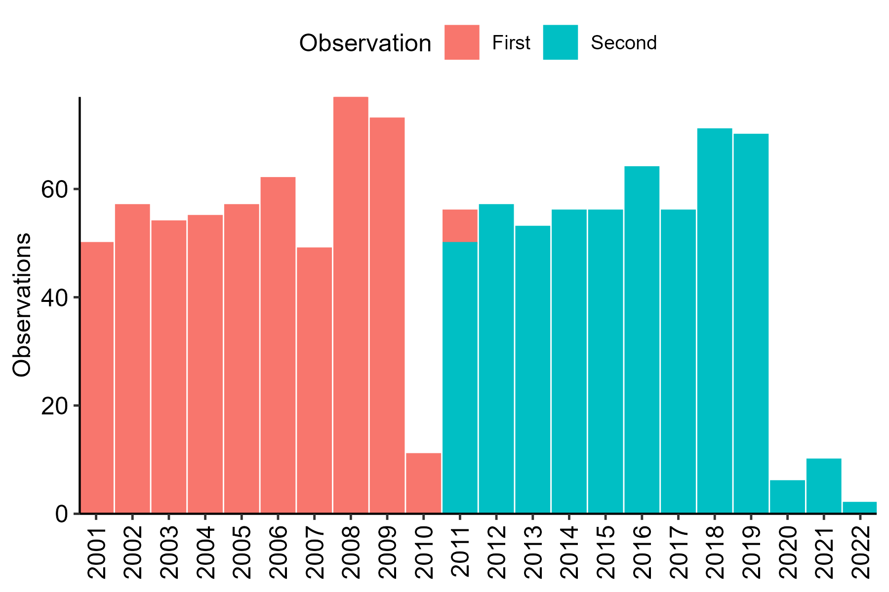
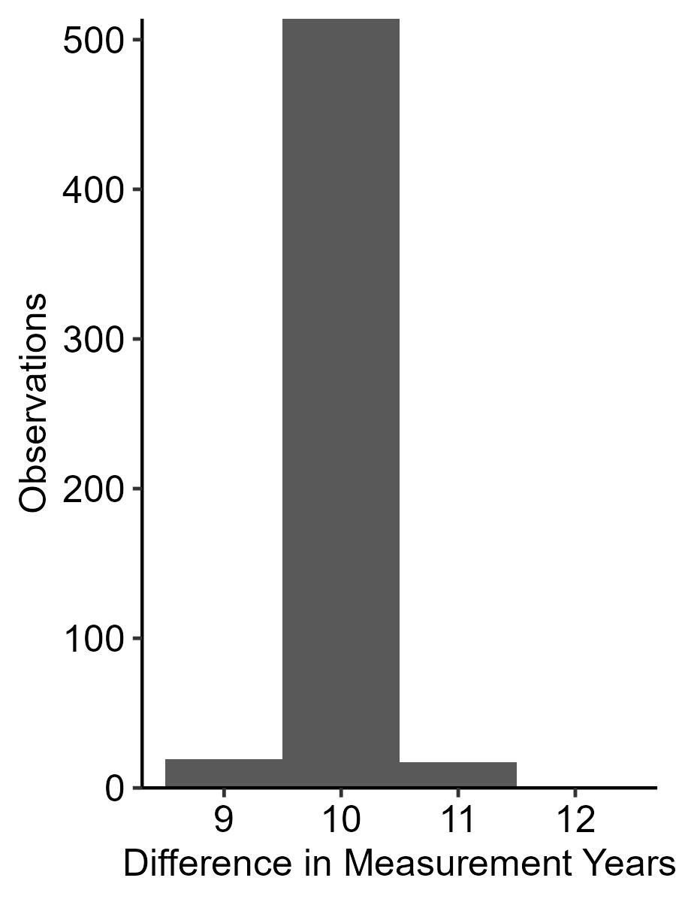
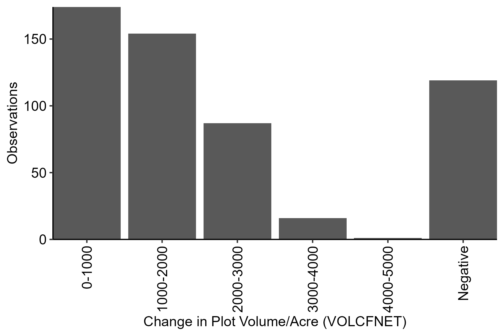

# Processing FIA Data for FNCAP


# Objectives

This document processes FIA data, then sets up initial exploration and
visualization for growth modeling.

The next step is to add growth models following Hashida and Fenichel
(2021).

# Results Preview

- Processing FIA data for private Douglas Fir stands in western Oregon
  returns 551 plots.

  - (That is, 551 plots with at least one pair of observations over
    time.)

- A fair number of plots decrease in volume between observations.

- That, plus data handling decisions around age (FLDAGE), limits
  modeling.

# Code and Results

## 1. Data

``` r
dat_or_plot = "data/OR_PLOT.csv" %>% read_csv # 9 MB

dat_or_cond = "data/OR_COND.csv" %>% read_csv # 18 MB

dat_or_tree = "data/OR_TREE.csv" %>% read_csv # 429 MB
```

## 2. Filtering Plots

``` r
# 2. Filter plots to those (a) in western Oregon (b) with at least one pair of observations.

dat_or_plot_less = 
  dat_or_plot %>% 
  # Filter to western Oregon.
  filter(LON < -120) %>% 
  # Filter to pairs of observations.
  #  This drops plots without multiple observations.
  mutate(MATCH_CN = ifelse(is.na(PREV_PLT_CN), CN, PREV_PLT_CN)) %>% 
  group_by(MATCH_CN) %>% 
  filter(n() > 1) %>%
  ungroup %>% 
  # Select columns to keep for joins.
  select(STATECD, 
         UNITCD, 
         COUNTYCD, 
         PLOT, 
         MATCH_CN,
         INVYR, 
         MEASYEAR, 
         LON, 
         LAT)
```

## 3. Filtering Conditions

``` r
# 3. Filter conditions to private Douglas fir.

dat_or_cond_less = 
  dat_or_cond %>% 
  # Filter.
  filter(FORTYPCD %in% 201:203 & OWNGRPCD == 40) %>% 
  # Select columns to keep for joins. 
  select(STATECD, 
         UNITCD, 
         COUNTYCD, 
         PLOT, 
         CONDID, 
         CONDPROP_UNADJ,
         INVYR, 
         FLDAGE,
         STDAGE,
         SITECLCD,
         DSTRBCD1, 
         DSTRBYR1, 
         TRTCD1, 
         TRTYR1)
```

## 4. Filtering Trees

``` r
# 4. Join filters on plot and condition.

dat_or_keep = 
  dat_or_cond_less %>% 
  left_join(dat_or_plot_less) %>% 
  semi_join(dat_or_plot_less)

# 5. Use the result of (4) to filter trees, then filter trees to Douglas fir.

dat_or_tree_less = 
  dat_or_tree %>% 
  # Select columns that we might use.
  select(ends_with("CN"),
         STATECD,
         UNITCD,
         COUNTYCD,
         PLOT,
         CONDID,
         TREE,
         INVYR,
         # STATUSCD,
         SPGRPCD,
         SPCD,
         # TOTAGE,
         # BHAGE,
         # starts_with("VOL"),
         VOLCFNET,
         # starts_with("DRYBIO"),
         # DRYBIO_AG,
         # DRYBIO_BG,
         # starts_with("CARBON"),
         # CARBON_AG,
         # CARBON_BG,
         TPA_UNADJ) %>% 
  # Get plot and condition information.
  left_join(dat_or_keep,
            by = c("STATECD", "UNITCD", "COUNTYCD", "PLOT", "CONDID", "INVYR")) %>% 
  # Filter on plot and condition.
  semi_join(dat_or_keep,
            by = c("STATECD", "UNITCD", "COUNTYCD", "PLOT", "CONDID", "INVYR")) %>% 
  # Filter on species group (down to Douglas firs). 
  filter(SPGRPCD == 10) 
```

## 5. Aggregation and Pivot

``` r
# 6. Aggregate to plot-acres (?!), then pivot so that rows are plots with timesteps in columns.

dat_or_tree_wide = 
  dat_or_tree_less %>% 
  group_by(STATECD, # Mind implicit drops.
           UNITCD, 
           COUNTYCD, 
           PLOT, 
           # CONDID, 
           MATCH_CN, 
           INVYR, 
           MEASYEAR, 
           # FLDAGE, 
           # STDAGE, 
           LON, 
           LAT) %>% 
  # Aggregate to plot. 
  summarize(VOLCFNET = sum(VOLCFNET * TPA_UNADJ, na.rm = TRUE)) %>% 
  ungroup %>% 
  group_by(STATECD, UNITCD, COUNTYCD, PLOT) %>% 
  # Drop stands with more or fewer than two observations.
  filter(n() == 2) %>%  
  mutate(PLOT_UID = paste(STATECD, UNITCD, COUNTYCD, PLOT, sep = "_")) %>% 
  ungroup %>% 
  select(-c(STATECD, UNITCD, COUNTYCD, PLOT)) %>%
  relocate(PLOT_UID) %>% 
  arrange(PLOT_UID) %>% 
  group_by(PLOT_UID) %>% 
  # Get an ID for first/second observations.
  #  Note that including STDAGE depends on handling conditions.
  mutate(WHICH = ifelse(MEASYEAR == max(MEASYEAR), 1, 0)) %>% 
  ungroup %>% 
  pivot_wider(names_from = WHICH,
              values_from = c(INVYR, MEASYEAR, VOLCFNET)) %>% # STDAGE, 
  mutate(MEASYEAR_D = MEASYEAR_1 - MEASYEAR_0,
         # STDAGE_D = STDAGE_1 - STDAGE_0,
         VOLCFNET_D = VOLCFNET_1 - VOLCFNET_0,
         VOLCFNET_P = VOLCFNET_1 / VOLCFNET_0 - 1) 
```

## 6. Histograms

Text.



Text.



Text.


Text.



Text.

# Discussion
