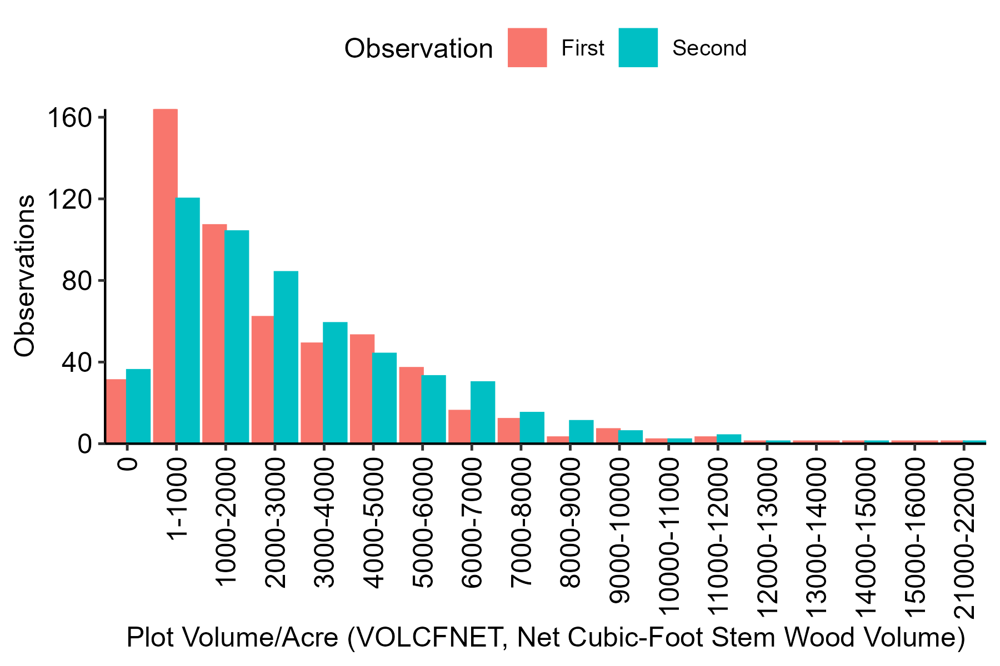

# Processing FIA Data for FNCAP


# Objectives

This document processes FIA data, then sets up initial exploration and
visualization for growth modeling.

The next step is to add growth models following Hashida and Fenichel
(2021).

# Results Preview

- Processing FIA data for private Douglas Fir stands in western Oregon
  returns 551 plots.

  - (That is, 551 plots with at least one pair of observations over
    time.)

- A fair number of plots decrease in volume between observations.

- That, plus data handling decisions around age (FLDAGE), limits
  modeling.

# Code and Results

## 1. Data

``` r
dat_or_plot = "data/OR_PLOT.csv" %>% read_csv # 9 MB

dat_or_cond = "data/OR_COND.csv" %>% read_csv # 18 MB

dat_or_tree = "data/OR_TREE.csv" %>% read_csv # 429 MB
```

## 2. Filtering Plots

This code filters the full set of plots in Oregon down to those (a) west
of a placeholder cut-off on longitude and (b) with at least one pair of
observations.

``` r
dat_or_plot_less = 
  dat_or_plot %>% 
  # Filter to plots in western Oregon.
  filter(LON < -120) %>% 
  # Filter to plots with at least two observations.
  mutate(MATCH_CN = ifelse(is.na(PREV_PLT_CN), CN, PREV_PLT_CN)) %>% 
  group_by(MATCH_CN) %>% 
  filter(n() > 1) %>%
  ungroup %>% 
  # Select columns to keep for joins.
  select(STATECD, 
         UNITCD, 
         COUNTYCD, 
         PLOT, 
         MATCH_CN,
         INVYR, 
         MEASYEAR, 
         LON, 
         LAT)
```

## 3. Filtering Conditions

This code filters the full set of conditions in Oregon down to private
land with Douglas fir stands.

``` r
# 3. Filter conditions to private Douglas fir.

dat_or_cond_less = 
  dat_or_cond %>% 
  # Filter.
  filter(FORTYPCD %in% 201:203 & OWNGRPCD == 40) %>% 
  # Select columns to keep for joins. 
  select(STATECD, 
         UNITCD, 
         COUNTYCD, 
         PLOT, 
         CONDID, 
         CONDPROP_UNADJ,
         INVYR, 
         FLDAGE,
         STDAGE,
         SITECLCD,
         DSTRBCD1, 
         DSTRBYR1, 
         TRTCD1, 
         TRTYR1)
```

## 4. Filtering Trees

This code uses the subsets of plots and conditions from (2) and (3) to
filter trees down to Douglas fir stands on private land in western
Oregon with at least two observations, then filters the resulting subset
of trees down to Douglas firs.

``` r
# Join subsets of plots and conditions.

dat_or_keep = 
  dat_or_cond_less %>% 
  left_join(dat_or_plot_less) %>% 
  semi_join(dat_or_plot_less)

# Use those subsets to filter trees.

dat_or_tree_less = 
  dat_or_tree %>% 
  # Select columns that we might use.
  select(ends_with("CN"),
         STATECD,
         UNITCD,
         COUNTYCD,
         PLOT,
         CONDID,
         TREE,
         INVYR,
         # STATUSCD,
         SPGRPCD,
         SPCD,
         # TOTAGE,
         # BHAGE,
         # starts_with("VOL"),
         VOLCFNET,
         # starts_with("DRYBIO"),
         # DRYBIO_AG,
         # DRYBIO_BG,
         # starts_with("CARBON"),
         # CARBON_AG,
         # CARBON_BG,
         TPA_UNADJ) %>% 
  # Get plot and condition information.
  left_join(dat_or_keep,
            by = c("STATECD", "UNITCD", "COUNTYCD", "PLOT", "CONDID", "INVYR")) %>% 
  # Filter on plot and condition.
  semi_join(dat_or_keep,
            by = c("STATECD", "UNITCD", "COUNTYCD", "PLOT", "CONDID", "INVYR")) %>%
  # Filter on species group (down to Douglas firs). 
  filter(SPGRPCD == 10) 
```

## 5. Aggregation and Pivot

This code aggregates the trees identified in (4) up to plots, with tree
measurements transformed into per-acre metrics, then pivots the data so
that each row describes a plot at two timesteps. This step drops
observations 3-N for plots with more than two observations. That isn’t
ideal, but it’s the simplest option and affects only a few plots. This
step is also where changes to keep additional condition information
(FLDAGE or STDAGE to follow Hashida and Fenichel) would come in.

``` r
dat_or_tree_wide = 
  dat_or_tree_less %>% 
  group_by(STATECD, # Mind implicit drops.
           UNITCD, 
           COUNTYCD, 
           PLOT, 
           # CONDID, 
           MATCH_CN, 
           INVYR, 
           MEASYEAR, 
           # FLDAGE, 
           # STDAGE, 
           LON, 
           LAT) %>% 
  # Aggregate to plot. 
  summarize(VOLCFNET = sum(VOLCFNET * TPA_UNADJ, na.rm = TRUE)) %>% 
  ungroup %>% 
  group_by(STATECD, UNITCD, COUNTYCD, PLOT) %>% 
  # Drop stands with more or fewer than two observations.
  filter(n() == 2) %>%  
  # Set up a unique identifier for plots.
  mutate(PLOT_UID = paste(STATECD, UNITCD, COUNTYCD, PLOT, sep = "_")) %>% 
  ungroup %>% 
  select(-c(STATECD, UNITCD, COUNTYCD, PLOT)) %>%
  relocate(PLOT_UID) %>% 
  arrange(PLOT_UID) %>% 
  group_by(PLOT_UID) %>% 
  # Get an ID for first/second observations.
  mutate(WHICH = ifelse(MEASYEAR == max(MEASYEAR), 1, 0)) %>% 
  ungroup %>% 
  pivot_wider(names_from = WHICH,
              values_from = c(INVYR, MEASYEAR, VOLCFNET)) %>% # STDAGE, 
  mutate(MEASYEAR_D = MEASYEAR_1 - MEASYEAR_0,
         # STDAGE_D = STDAGE_1 - STDAGE_0,
         VOLCFNET_D = VOLCFNET_1 - VOLCFNET_0,
         VOLCFNET_P = VOLCFNET_1 / VOLCFNET_0 - 1) 
```

## 6. Histograms

These figures check whether the data make sense.


To start off, measurement years look about right: first and second
observations are more or less uniform for 2001-2007 and 2011-2017, and
then there are some jumps for 2008-2009 and 2018-2019 and drops for 2010
and 2020-2022.


This checks for nonsense results and finds none. Almost all measurement
intervals are 10 years, and the oddball intervals are only a little
different at 9, 11, and 12 years.



The volume/acre measurements fall on a nice distribution. The zero
values are ominous.


While change in volume/acre between timesteps also falls on a nice
distribution, the “Negative” bin is a problem: a fair proportion of
plots see volume decrease over time. I haven’t found cases where that’s
a problem resulting from measurement or computation, so I’m assuming
that reflects the real rate of harvest and disturbance for this subset
of plots. For the rest of this document, I’m assuming that only plots in
that negative bin reflect harvest and disturbance. That’s not a great
assumption, though, so figuring out a better approach might be a
prerequisite for meaningful growth models.

## 7. Changes over Timesteps

These figures take an initial look at growth to inform modeling and get
at the negative growth issues. As above, “VOLCFNET” is net cubic-foot
stem wood volume. I didn’t pull VOLBNET through for these figures since
it should return more or less the same results, but that and any other
volume/biomass/carbon variables of interest are available for more
exploration and/or modeling. “VOLCFNET_0” is volume at the first
timestep, “VOLCFNET_D” is the difference in volume between the first and
second timesteps, “VOLCFNET_P” is the percent change in volume between
the first and second timesteps, and “log(VOLCFNET_P)” is the log of the
percent change.


Most plots suggest a nice growth curve. The plots with negative growth
appear to fall on a different distribution of initial volume than the
rest.


I believe we had talked about this specific plot to inform growth
modeling, but it isn’t quite informative without transformation.


With transformation, the same plot is a little more informative: plots
with non-negative growth describe a nice curve, with plots of greater
initial volume returning less growth than plots of lesser initial
volume. So, without worrying too much about the plots with negative
growth and other plots with disturbances, the data should support a
growth model following Hashida and Fenichel.

# Discussion

1.  In general, the data look right, and I’m hoping this workflow
    matches what we’ve discussed.

    - If this workflow goes off the rails somewhere along the lines, it
      should be explicit in the code – I’m starting from raw FIA
      exports.

2.  However, dealing with harvest and disturbances needs some further
    discussion.

    - I can pull condition data describing harvest, disturbance, and
      treatment through, but then sticking those variables into models
      would diverge from Hashida and Fenichel’s approach. We could also
      drop plots that undergo harvest, disturbance, and/or treatment,
      which I’m supposing is what Hashida and Fenichel did (in the
      absence of documentation for initial data handling).

3.  If I pull age measurements (FLDAGE, STDAGE) through from condition
    data, I can fully replicate Hashida and Fenichel’s growth model. Is
    that the right next step? If so, what aggregation of age
    measurements from condition to plot would be appropriate?
